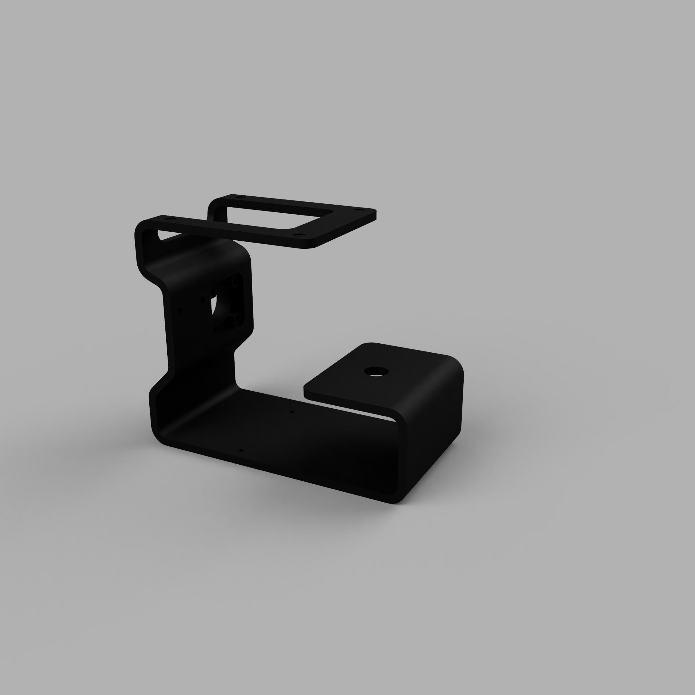
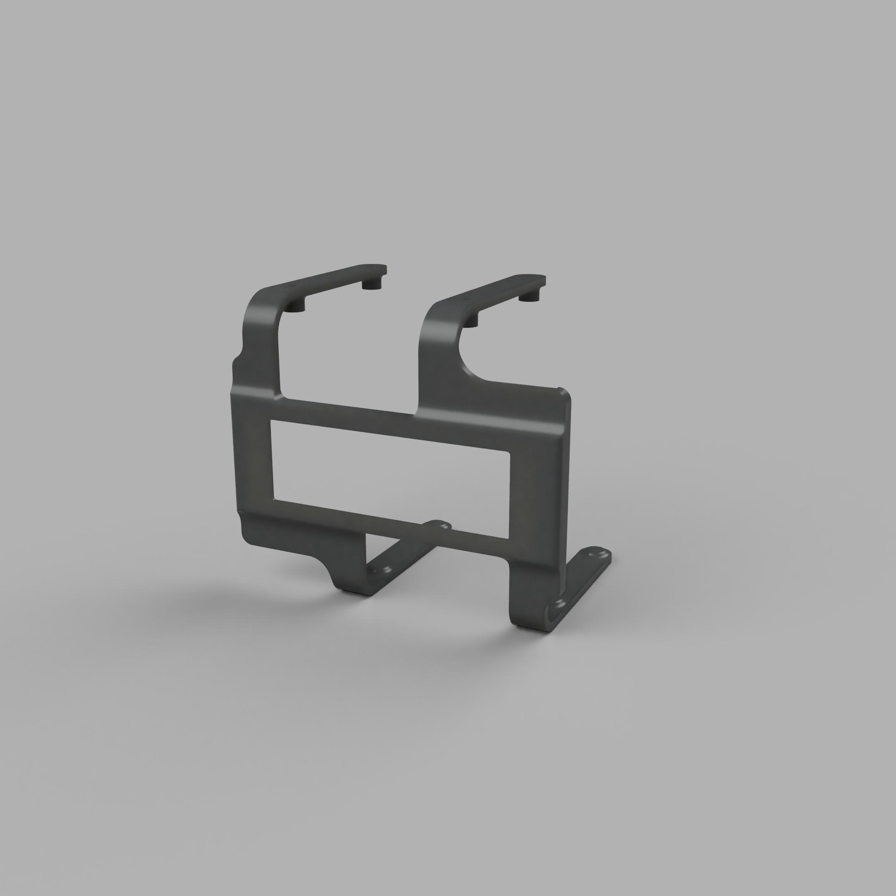
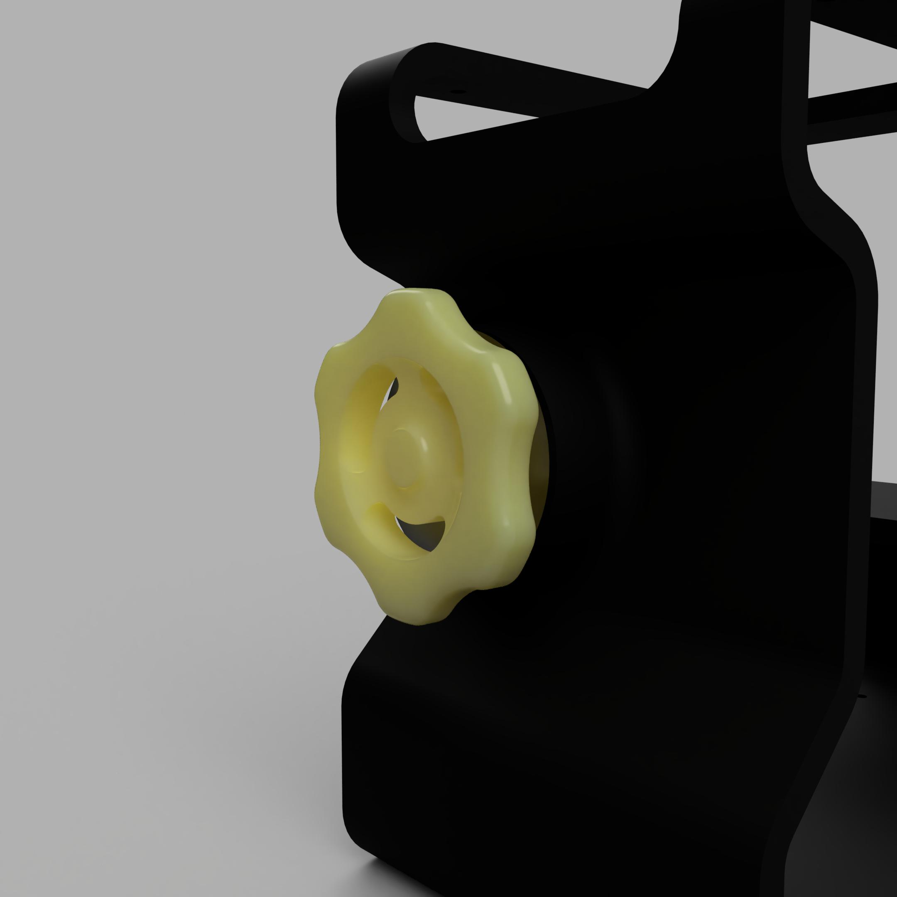

# The multifunctional device to interact with your pc
and to collect the dust :) \


# General Info

- This device was created for my own purposes
- All parts are designed by me and ready to print
- The valve rotation is encoded by the AS5600 chip
    - [AS5600 magnetic encoder datasheet](https://files.seeedstudio.com/wiki/Grove-12-bit-Magnetic-Rotary-Position-Sensor-AS5600/res/Magnetic%20Rotary%20Position%20Sensor%20AS5600%20Datasheet.pdf)
- When the mode is changed the vibration motor gives you a tactile feedback
- The screen is 20x4 WS0010-based char display from Winstar
    - [Display link](https://www.winstar.com.tw/products/oled-module/oled-character-display/20x4-oled.html)
    - [WS0010 datasheet](https://cdn-shop.adafruit.com/datasheets/WS0010.pdf)

# Interaction

- The switch to turn on the PC and put it to the sleep mode\


- The valve to choose the mode of the device\


## Currently available modes
- gambling (kinda like a slot machine)
- Temperature monitor for the PC
- Clock
- Screensaver like the DVD logo
- nothing

# How does it work?
- The main PC hosts the ASP.NET app that can put it into sleep and sends the json with CPU/GPU temperatures via http
- The RPi hosts a client service that
    -  wakes PC using WOL packet
    -  requests the temps from the API to show them on the screen

# Setup

## Part 0. Wiring

* AS5600:
    * SDA -> GPIO2
    * SCL -> GPIO3
    * VCC -> 3.3 V
    * GND -> GND
    * DIR -> GND

* Vibration motor
    * VCC -> 5V (or 3.3V if you wnat it to be more gentle)
    * GND -> GND
    * IN -> GPIO10

* Screen
    * 1 GND -> GND
    * 2 VCC -> 5V
    * 3 NC -> _
    * 4 RS -> GPIO14
    * 5 R/W -> GND
    * 6 E -> GPIO15
    * 7 DB0 -> _
    * 8 DB1 -> _
    * 9 DB2 -> _
    * 10 DB3 -> _
    * 11 DB4 -> GPIO18
    * 12 DB5 -> GPIO23
    * 13 DB6 -> GPIO24
    * 14 DB7 -> GPIO25
    * 15 NC -> _
    * 16 NC -> _

You can do your own wiring, but in that case you need to change the GPIO numbers in the `main.c` and the `hotslug.h`

## Part 1. PC
### Prerequisites

* .NET SDK installed (e.g., .NET 6/7/8)
* An ASP.NET Core project
* Administrator/root privileges (required to create services)

Check your SDK:

```pwsh
dotnet --version
```

---

### 1. Build the Project (Release Mode)

From the repository root:

```bash
cd Server
dotnet build -c Release
```


### 2. Publish the Project

```pwsh
dotnet publish -c Release -o ./publish
```

### 3. Create a Windows Service (Windows)

#### 3.1 Copy files

Copy the contents of the `publish` folder to a permanent location, e.g.:

```
C:\Services\MyAspNetApp
```

#### 3.2 Create the service

Run **PowerShell as Administrator**:

```pwsh
New-Service \
  -Name "MyAspNetApp" \
  -BinaryPathName "C:\Services\MyAspNetApp\MyAspNetApp.exe" \
  -DisplayName "My ASP.NET Core App" \
  -StartupType Automatic
```

### 3.3 Start the service

```powershell
Start-Service MyAspNetApp
```

### 3.4 Check status

```powershell
Get-Service MyAspNetApp
```

Logs are typically written to Windows Event Viewer or application-specific log files.

## Part 2. Raspberry Pi

### Prerequisites

* Raspberry Pi OS (Debian-based)
* CMake-based C or C++ project
* Root (sudo) access

### Required packages

```bash
sudo apt update
sudo apt install -y \
  build-essential \
  cmake \
  pigpio \
  libcurl4-openssl-dev \
  libcjson-dev
```

```bash
sudo systemctl enable pigpiod
sudo systemctl start pigpiod
```

### 1. Copy files
* Copy **Client** and **util** folders to any location on your RPi
* Create permanent folder
```bash
sudo mkdir /var/www
sudo mkdir /var/www/hotslug
```
### 2. Build the project
In the `Client` folder run:
```bash
mkdir -p build
cd build
cmake  ..
sudo make
```
Optional: test the binary locally
```bash
sudo bash /var/www/hotslug/hotslug
```

### 3. Create the service

* Navigate to the util directory
* Run
```bash
sudo ./link_service.sh
```

### 4. Change the IP and MAC in hotslug.h

```C
22 #define WAKE_UP "sudo etherwake <YOUR MAC>"
23 #define SLEEP_DOWN "curl -X POST http://<YOUR IP>:5221/api/control/sleep"
24 #define TEMPS  "http://<YOUR IP>:5221/api/temps"
```

# 3D-models
* main-case.stl \


* rpi-and-screen-mount.stl \


* valve.stl \


# Yapping

- feel free to use
- feel free to contribute
